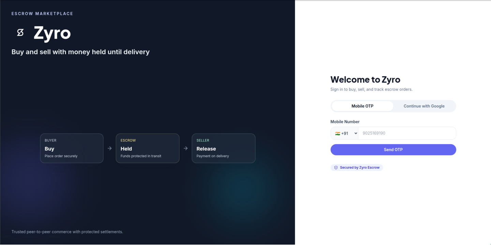
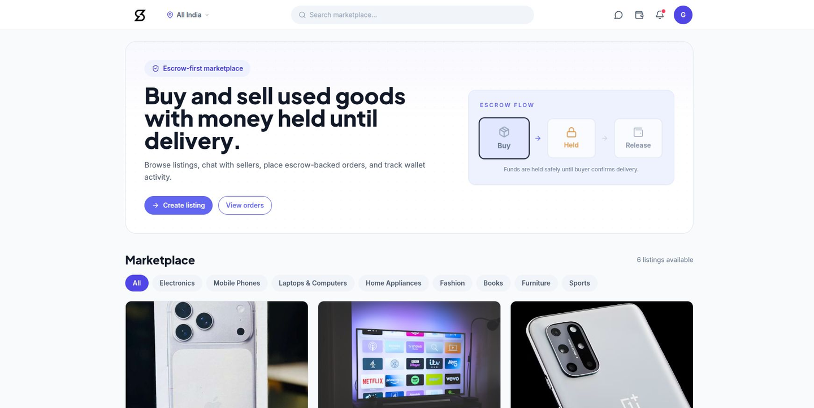
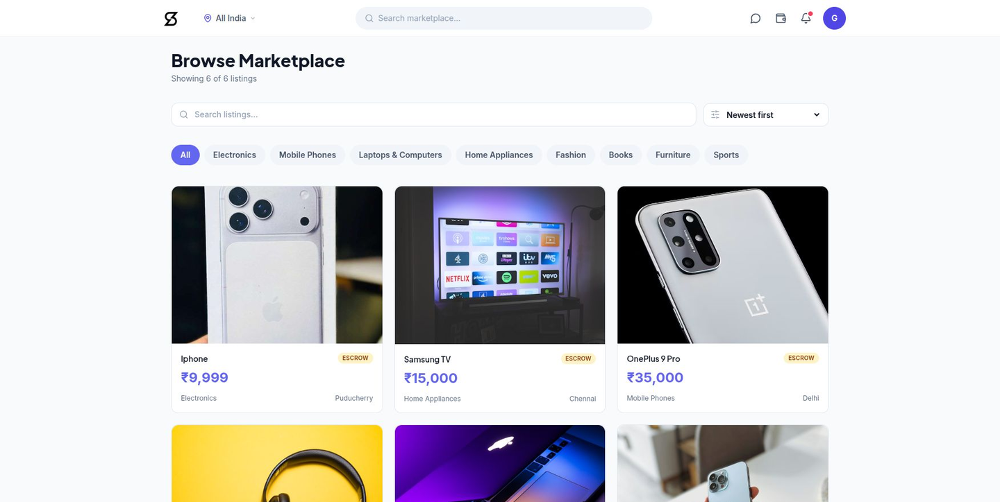
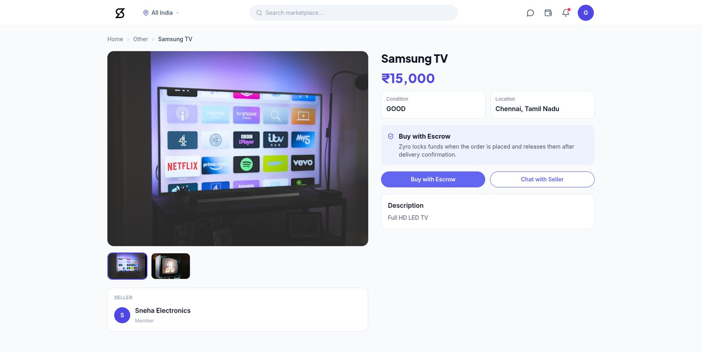
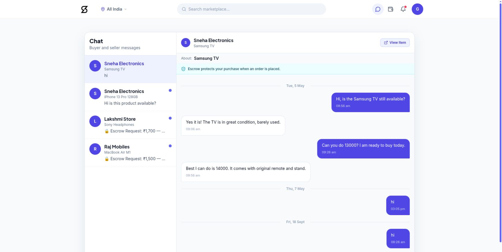
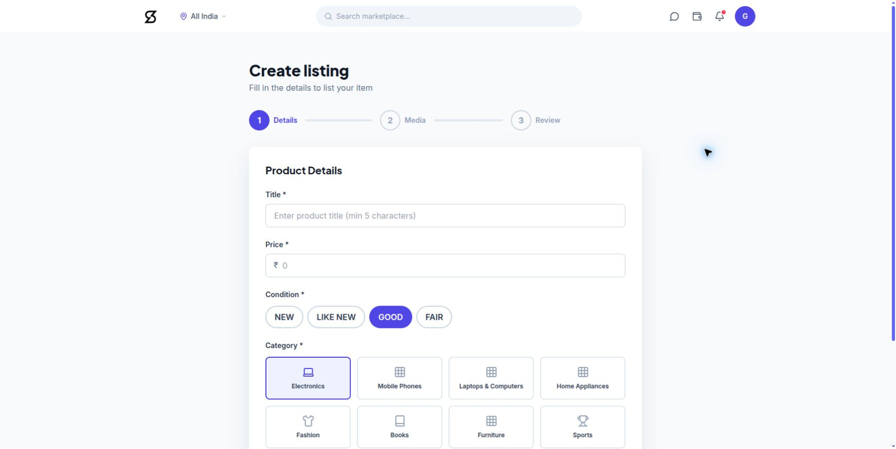
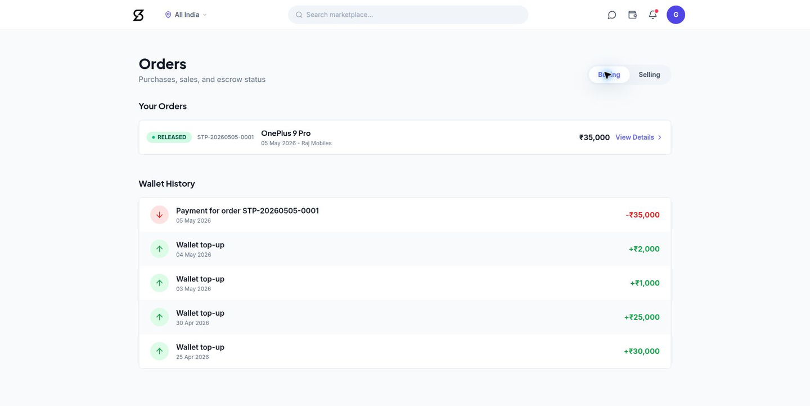
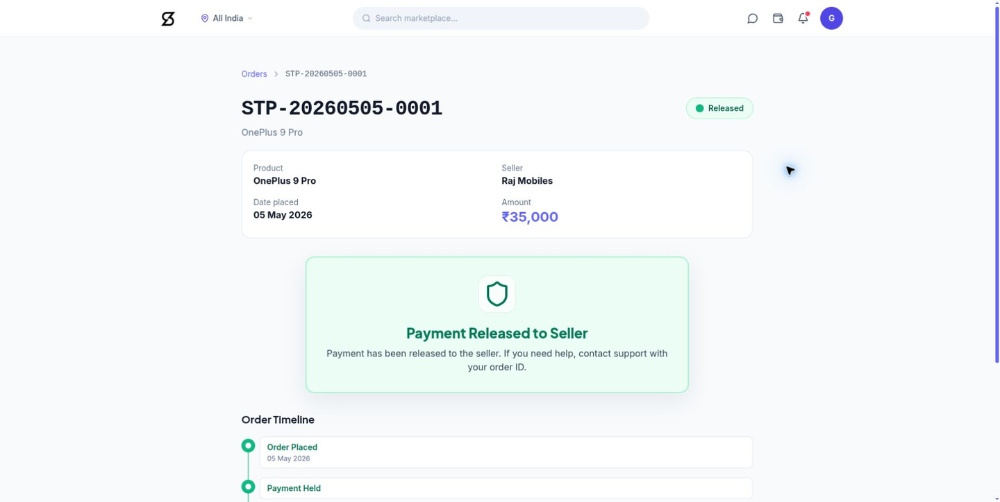
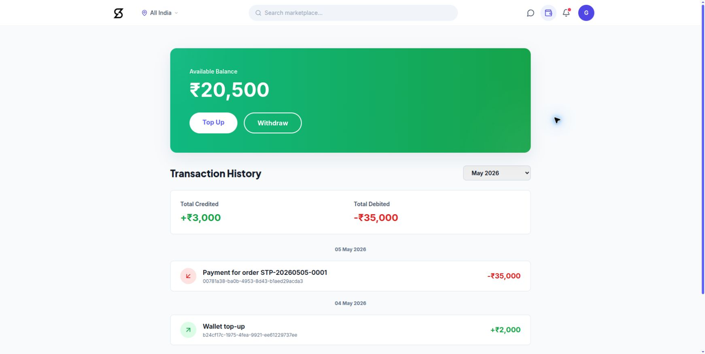
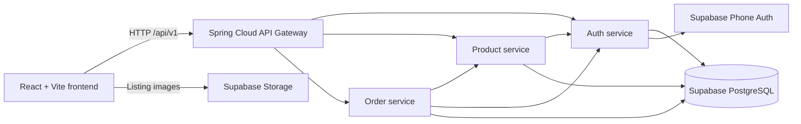

# Zyro — Trust-First Marketplace

## Overview

Zyro is a startup proof of concept for a peer-to-peer second-hand marketplace focused on safer transactions between buyers and sellers. The application combines product discovery, buyer–seller communication, order tracking, wallet activity, and an escrow-oriented transaction flow in one responsive interface.

This repository contains the public React frontend. The supporting Spring Boot microservices currently run locally and are not available as a public hosted backend.

## Problem statement

Buying used goods from strangers introduces uncertainty: buyers may pay before receiving the promised item, while sellers may ship without confidence that payment will be completed. Informal conversations and direct transfers also make transaction status difficult to track.

## Proposed solution

Zyro explores a trust-first marketplace flow in which:

1. A buyer discovers a listing and communicates with the seller.
2. An order records the agreed product and amount.
3. Funds are represented as held in escrow during fulfilment.
4. Delivery confirmation releases the payment to the seller, while cancellation or dispute paths protect the held funds.

The current implementation is a POC, not a production payment or escrow service.

## Key features

- Mobile OTP authentication through Supabase Auth and the local auth service
- Marketplace browsing, search, category filters, sorting, and product details
- Seller listing form with image-upload integration through Supabase Storage
- Buyer–seller chat threads and message history
- Buying and selling order views with escrow status
- Order detail timeline for held, released, refunded, and disputed states
- Wallet balance and transaction history
- Profile editing and seller-access flows
- Switchable mock API for offline frontend demonstrations

Google sign-in, withdrawals, production KYC, public deployment, and production-grade payments are not complete. Mock mode simulates data and transactional behavior; it must not be confused with the live Spring/Supabase integration.

## Screenshots

These screenshots were captured from the application running locally in live API mode against the Spring Boot services and Supabase-backed data. Personal profile details and credentials are not shown.

| Authentication | Home |
|---|---|
|  |  |

| Marketplace | Product details |
|---|---|
|  |  |

| Buyer–seller chat | Create listing |
|---|---|
|  |  |

| Orders | Escrow order details |
|---|---|
|  |  |

| Wallet |
|---|
|  |

## Technology stack

### Frontend

- React 18 and React Router 6
- Vite 5
- Tailwind CSS 3
- Axios
- Supabase JavaScript client for Storage uploads
- Lucide React and React Hot Toast

### Backend

- Java 17 and Spring Boot 3.2
- Spring Cloud Gateway
- Spring Security and JWT
- Spring Data JPA / Hibernate
- PostgreSQL hosted by Supabase
- Supabase Phone Auth
- Four services: API gateway, auth, product, and order

## Architecture



The frontend calls the gateway at `http://localhost:8080/api/v1`. The gateway routes authentication and user requests to the auth service, listing and chat requests to the product service, and order and escrow requests to the order service.

## Local setup

### Prerequisites

- Node.js and npm
- Java 17
- Maven 3.9 or newer
- Access to a Supabase project containing the required Zyro schema
- `curl` for the local runner's health checks

Docker is optional. Docker Compose starts the backend services but does not provision PostgreSQL or start the frontend.

### Frontend-only demo mode

```bash
cd frontend
npm ci
cp .env.example .env
# Set VITE_USE_MOCK=true
npm run dev
```

Demo mode uses in-browser mock data and does not require the backend. Authentication, orders, wallet operations, and chat behavior in this mode are simulations.

### Full local stack

From the project directory:

```bash
cd backend
cp .env.example .env
# Fill the documented database, JWT, and Supabase values.
./run-local.sh
```

`run-local.sh` builds and starts the auth service on `8081`, product service on `8082`, order service on `8083`, API gateway on `8080`, and frontend on `5173`. It forces the frontend into live API mode and checks the main health and product routes.

Use the exact Session Pooler host and username copied from **Supabase Dashboard → Connect**. Do not commit `.env` files, database passwords, JWT secrets, OTPs, access tokens, or private keys.

The relevant frontend settings are documented in `.env.example`:

```env
VITE_USE_MOCK=true
VITE_API_BASE_URL=http://localhost:8080/api/v1
VITE_SUPABASE_URL=
VITE_SUPABASE_ANON_KEY=
```

Set `VITE_USE_MOCK=false` for the live backend. The Supabase frontend values are needed only for features that call Supabase directly, such as Storage uploads.

## Backend availability

Zyro is currently a proof of concept. The frontend source code is publicly available, while the backend microservices are intended to run locally using the documented startup procedure. A public hosted backend is not currently provided. Consequently, backend-dependent features may not work for visitors using only the public frontend.

## Project status and limitations

The local live stack has been verified for OTP authentication, marketplace/category loading, product details, existing chat history, order and released-escrow details, wallet history, and access to the seller listing form.

Current limitations include:

- No public hosted backend or verified live demo URL
- Google authentication is a placeholder
- Withdrawals are marked as coming soon
- KYC and some settings/notification experiences are incomplete
- Live message sending was not exercised during the public screenshot run
- A new listing was not published during verification to avoid adding test data
- No active held order was available for safely exercising live confirm-delivery or dispute transitions
- Supabase Storage uploads depend on the project's bucket and access policies
- The escrow and wallet implementation is suitable for POC demonstration only, not real-money custody

## Future improvements

- Deploy the gateway and services with managed secrets and observability
- Integrate a regulated payment/escrow provider
- Complete KYC, dispute review, notifications, and withdrawals
- Add automated end-to-end tests for buyer and seller journeys
- Harden rate limiting, audit logging, authorization, and storage policies
- Add CI checks and a verified public demo environment
